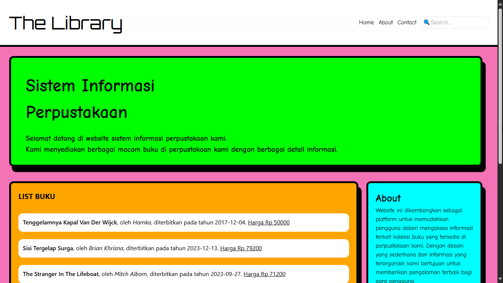

# Sistem-Informasi-Perpustakaan

Sistem informasi perpustakaan sederhana berbasis web untuk mengelola data buku. Dibangun menggunakan HTML, Tailwind, dan PHP. Project ini merupakan tugas dari Bootcamp Web Developer (PHP, Laravel, MySQL) Nusacodes.

## Instalasi
1. Clone repository ini
2. Import database dari file `.sql` ke MySQL
3. Sesuaikan konfigurasi database di `config.php`
4. Jalankan di web server

## Teknologi
- HTML5
- Tailwind 
- PHP
- MySQL